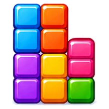

# CandyTetris

<!-- BADGES:BEGIN -->
[](https://github.com/detain/sugarcraft/actions/workflows/ci.yml)
[](https://app.codecov.io/gh/detain/sugarcraft?flags%5B0%5D=candy-tetris)
[](https://packagist.org/packages/sugarcraft/candy-tetris)
[](LICENSE)
[](https://www.php.net/)
<!-- BADGES:END -->


Tetris built on the SugarCraft stack. SugarCraft runtime, CandySprinkles for the rounded borders and per-piece colours, deterministic 7-bag RNG, ghost piece, hard drop, hold, level-driven gravity ramp, line-clear scoring.

## Run it

```bash
composer install
./bin/tetris         # Single player mode
./bin/tetris -v      # VS Computer mode
./bin/tetris --vs    # VS Computer mode (long form)
```

## VS Computer Mode

Compete against an AI opponent in split-screen mode. When you clear lines, garbage rows are sent to the computer. When the computer clears lines, garbage rows are sent to you. Last player standing wins!


### VS Mode Controls

| Key       | Action            |
|-----------|-------------------|
| ← / →     | Move left / right |
| ↑ / x     | Rotate clockwise  |
| z         | Rotate counter-cw |
| ↓         | Soft drop         |
| Space     | Hard drop         |
| p         | Pause / resume    |
| q         | Quit              |

The computer opponent uses weighted heuristics (board height, holes, gaps, lines) to make optimal moves.

## Controls

| Key       | Action            |
|-----------|-------------------|
| ← / →     | Move left / right |
| ↑ / x     | Rotate clockwise  |
| z         | Rotate counter-cw |
| ↓         | Soft drop         |
| Space     | Hard drop         |
| p         | Pause / resume    |
| q         | Quit              |

## Scoring

### Line-clear scoring

| Lines cleared | Base points × (level + 1) |
|---------------|----------------------------|
| 1             | 40                         |
| 2             | 100                        |
| 3             | 300                        |
| 4 (Tetris)    | 1200                       |

Level rises every 10 lines. Gravity speeds up at every level — by level 9 pieces fall every 6 frames, by level 29+ they fall every frame. The frame-rate-agnostic `Score::framesPerRow()` is what the gravity tick consults.

### T-Spin scoring

When a T piece is rotated into a position where two or more of its four diagonal corner cells are already filled (walls count as filled), it scores as a **T-Spin**:

| Type     | Base points |
|----------|-------------|
| T-Spin   | 400 × (level + 1) |
| T-Spin Mini | 100 × (level + 1) |

T-Spin Mini is detected when exactly two front corners are filled (the side the piece entered from).

**3-corner rule:** A T-Spin is active when the locked T piece's final position differs in rotation from its pre-lock rotation, AND at least two of the four diagonal corner cells around the T are occupied (wall/out-of-bounds = occupied). See `Scoring\TSpin::detect()`.

### Back-to-Back (B2B) bonus

Consecutive Tetris clears or full T-Spins (non-mini) carry a **1.5× multiplier** on the line-clear base points:

- 4-line Tetris after a prior Tetris → 1200 × 1.5 × (level + 1)
- Full T-Spin after a prior full T-Spin → 400 × 1.5 × (level + 1)

B2B resets when a 1–3 line clear or a T-Spin Mini breaks the streak.

### Combo bonus

Consecutive line clears (regardless of type) build a **combo counter** — each combo step adds `combo × 10 × (level + 1)` bonus points. The counter resets to 0 on any clean (zero-line) piece placement.

### Perfect clear bonus

When all lines are cleared at once and the board becomes completely empty, an additional **+5000 × (level + 1)** bonus is awarded.

## Shared foundations

All game renderers build their playfield and score panel via [candy-buffer](https://github.com/detain/sugarcraft/tree/master/candy-buffer). The 10×20 playfield is a canonical `Buffer` cell grid; per-tetromino background style and ghost-piece foreground style are applied per-cell. `Buffer::withRegion` composites the score panel over the playfield interior. Snapshot tests via [candy-testing](https://github.com/detain/sugarcraft/tree/master/candy-testing) pin canonical game states (starting board, T-spin completion, pause overlay).
